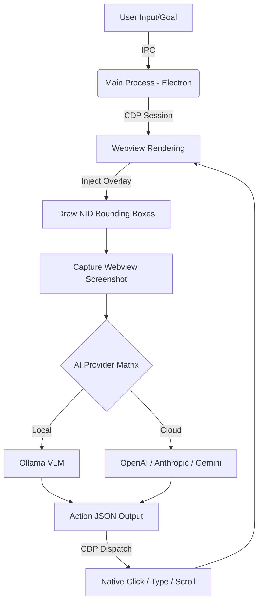

<div align="center">
  
# 👁️ NetraBrowser 
**The Open-Source, Vision-Driven Autonomous AI Browser**

[](https://electronjs.org/)
[](https://developer.mozilla.org/en-US/docs/Web/JavaScript)
[](https://ollama.com/)
[](https://openai.com/)
[](https://opensource.org/licenses/MIT)

**NetraBrowser** is a next-generation **Agentic Web Browser** that uses Vision-Language Models (VLMs) to visually "see" and autonomously interact with the web just like a human. Just type your goal, and watch the AI navigate, click, type, scroll, and extract data for you.

[Features](#-key-features) • [Installation](#-installation) • [How it Works](#-how-it-works-architecture) • [BYOM (Bring Your Own Model)](#-bring-your-own-model-byom)
</div>

---

## 🚀 Why NetraBrowser?

Traditional web automation relies on brittle DOM selectors or predefined scripts. **NetraBrowser** revolutionizes this by using pure **Computer Vision & CDP (Chrome DevTools Protocol)**. Instead of looking at raw HTML, the browser provides a screenshot of the webpage with intelligent bounding boxes (NIDs) to the AI. The AI sees the UI, makes a decision, and manipulates the page natively.

It’s the ultimate **Auto GPT for the Web**, capable of automating complex multi-step workflows, research, and data extraction autonomously.

## ✨ Key Features

- 🧠 **Bring Your Own Model (BYOM)**: Seamlessly switch between Local AI (Ollama `qwen3-vl`) for absolute privacy, or Cloud AI (OpenAI `gpt-4o`, Anthropic `claude-3.5-sonnet`, Google `gemini-2.5-flash`).
- 👁️ **Computer Vision Driven**: Injects robust bounding boxes around interactive elements (`Netra IDs / NIDs`). The model analyzes screenshots, not cluttered DOM trees.
- ⚡ **CDP-Powered Interactions**: Bypasses anti-bot detection by using native hardware-level event dispatching (mouse movements, clicks, and keystrokes) through the Chrome DevTools Protocol.
- 🕵️ **Real-Time Agent HUD**: Watch the AI's internal thought process and "action state" rendered directly onto your webpage with a sleek futuristic overlay.
- 🛡️ **Privacy First**: Fully local extraction and interaction when paired with Ollama. No data leaves your machine.

---

## 🛠️ How It Works (Architecture)

NetraBrowser seamlessly bridges the gap between state-of-the-art LLMs and deep browser integration.



---

## 📦 Installation

### Prerequisites
- Node.js (v18+ recommended)
- Optional but recommended: [Ollama](https://ollama.com/) (for 100% local, private AI features).

### Quick Start

1. **Clone the repository:**
   ```bash
   git clone https://github.com/yourusername/NetraBrowser.git
   cd NetraBrowser
   ```

2. **Install Dependencies:**
   ```bash
   npm install
   ```

3. **Start the Browser:**
   ```bash
   npm start
   ```

---

## ⚙️ Configuration & BYOM (Bring Your Own Model)

NetraBrowser gives you the ultimate freedom to define the intelligence of your browser. Open the **Settings Panel** inside the browser to configure:

1. **Ollama (Local)**: The browser will automatically try to pull and start `qwen3-vl:4b-instruct`. Fully offline capable.
2. **OpenAI**: Enter your API Key and utilize models like `gpt-4o`.
3. **Anthropic**: Powered by the cutting edge `claude-3-5-sonnet-20241022`.
4. **Gemini**: Lightning-fast visual processing with `gemini-2.5-flash`.

---

## 🧑‍💻 Usage Example

Open NetraBrowser, navigate to an e-commerce site, and type the following into the AI Panel:

> *"Find the price of the latest iPhone 15 Pro, compare it across the first three listings, and extract the highest rated seller's store name."*

**Watch as Netra:**
1. Evaluates the webpage visually.
2. Identifies the search bar via NID (Netra ID).
3. Types "iPhone 15 Pro" naturally via CDP keystrokes.
4. Clicks the search button.
5. Scrolls through the results to locate ratings and prices.
6. Summarizes the data exclusively for you.

---

## 🤝 Contributing

We welcome contributions! Whether you're fixing bugs, adding new LLM providers, or enhancing the CDP injection engine, your help is appreciated.

1. Fork the Project
2. Create your Feature Branch (`git checkout -b feature/AmazingFeature`)
3. Commit your Changes (`git commit -m 'Add some AmazingFeature'`)
4. Push to the Branch (`git push origin feature/AmazingFeature`)
5. Open a Pull Request

---

## 📄 License

Distributed under the MIT License. See `LICENSE` for more information.

---

<details>
<summary>SEO Search Tags (Expand)</summary>
AI Browser, Agentic Web Browser, Autonomous AI Web Agent, Auto GPT for Web, Playwright AI Alternative, Puppeteer AI, Electron AI App, Vision Language Model Web Automation, Ollama Browser, Local AI Web Scraper, Open Source AI Agent, LLM Web Navigation, Computer Vision DOM Interaction, Netra Browser.
</details>
